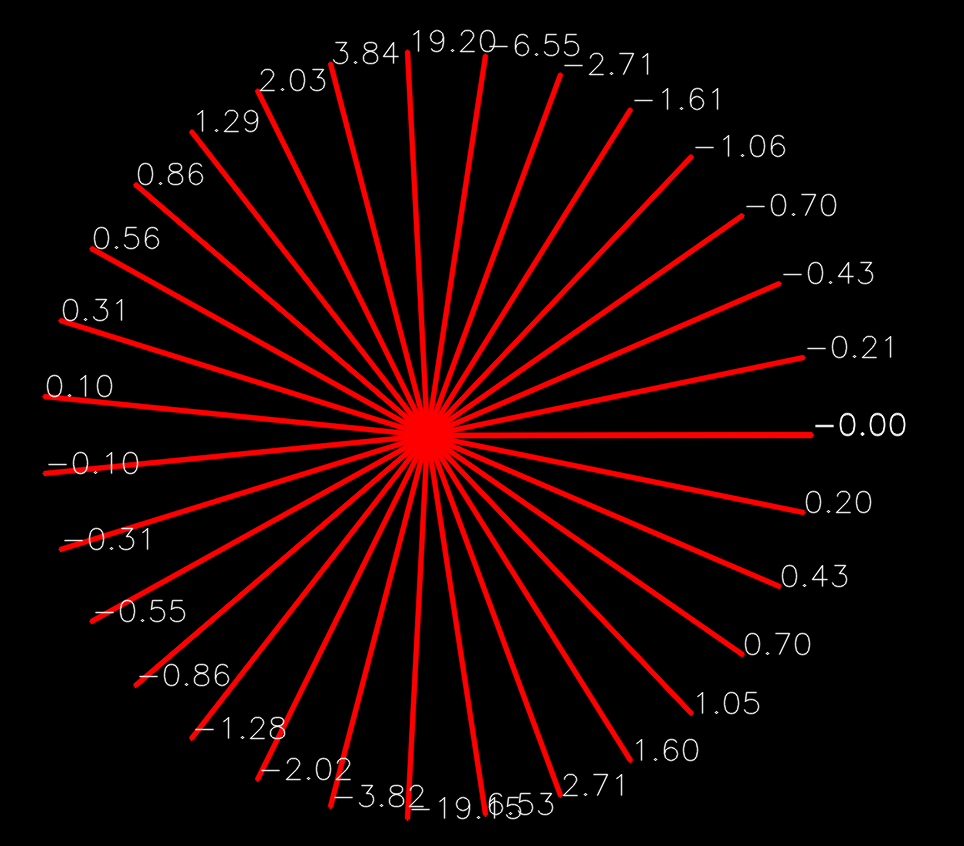
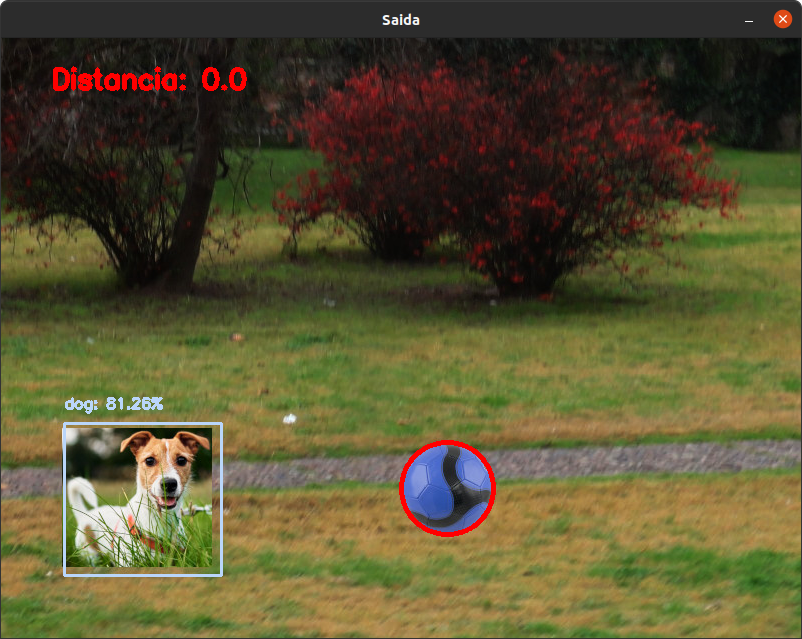
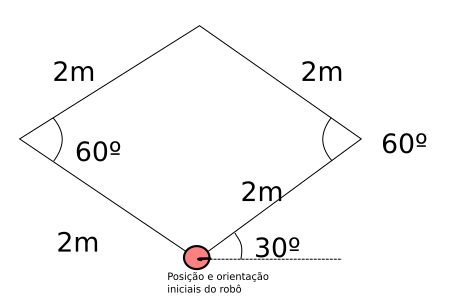
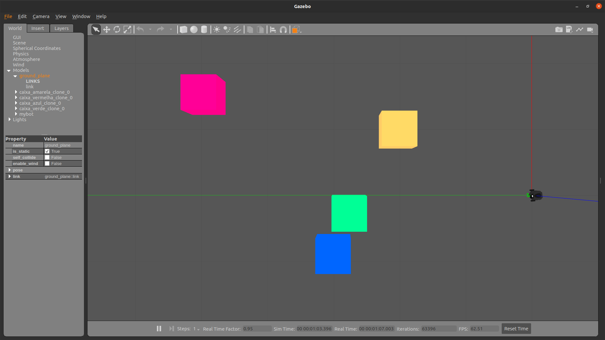

# Robótica Computacional 2021.2

[Mais orientações no README](./README.md)

## Segundo simulado da prova

**Aqui você deverá escolher 2 questões dentre 4 para responder em um período de 2h.**

**Na prova real haverá 4 questões e você escolherá 3, em um período de 4h**

Esta prova é baseada em questões de provas anteriores


Nome:_______________


Questões que fez:____________


Observações de avaliações nesta disciplina:

* Clone o repositório da prova dentro de `~/catkin_ws/src` se estiver trabalhando no Linux.
* Você poderá dar quantos `git push` quiser no repositório, apenas o último será considerado.
* Antes de finalizar a prova verifique que os arquivos enviados ao github estão na sua última versão. É sua responsabilidade garantir isso.
* Inicie a prova no Blackboard para a ferramenta de Proctoring iniciar.
* Só finalize a prova no Blackboard após enviar a prova via Github classroom.
* Durante esta prova vamos registrar somente a tela, não a câmera nem microfone
* Ponha o nome no enunciado da prova no Github
* Tenha os repositórios https://github.com/Insper/robot21.2/ ,  https://github.com/arnaldojr/my_simulation e https://github.com/arnaldojr/mybot_description.git  atualizados em seu `catkin_ws/src` .
* Você pode consultar a internet ou qualquer material, mas não pode se comunicar com pessoas ou colegas a respeito da prova
* Todos os códigos fornecidos estão executando perfeitamente. Foram testados no SSD da disciplina
* Teste sempre seu código
* Entregue código que executa - código com erro que impede de executar implica em zero na questào
* Faça commits e pushes frequentes no seu repositório (tem dicas [no final deste arquivo](./instrucoes_setup.md))
* Esteja conectado no Teams e pronto para receber calls do professor e da equipe. 
* Avisos importantes serão dados no chat da prova no Teams - deixe o Teams aberto.
* Permite-se consultar qualquer material online ou próprio. Não se pode compartilhar informações com colegas durante a prova.
* Faça commits frequentes. Em caso de disputa sobre plágio, o primeiro a enviar alguma ideia será considerado autor original.
* A responsabilidade por ter o *setup* funcionando é de cada estudante.
* Questões de esclarecimento geral podem ser perguntadas no chat do Teams.
* Se você estiver em casa pode fazer pausas e falar com seus familiares, mas não pode receber ajuda na prova.
* É proibido colaborar ou pedir ajuda a colegas ou qualquer pessoa que conheça os assuntos avaliados nesta prova.
* Os exercícios admitem diversas estratégias de resolução. A prova de cada aluno é única. Atenha-se apenas à rubrica de cada questão.
* Se precisar reiniciar para alternar entre Linux e seu sistema nativo reinicie o Proctoring e avise o professor via chat. 

Existe algumas dicas de referência rápida de setup [instrucoes_setup.md](instrucoes_setup.md)

**Integridade Intelectual**

Se você tiver alguma evidência de fraude cometida nesta prova, [use este serviço de e-mail anônimo](https://www.guerrillamail.com/pt/compose)  para informar ao professor através do e-mail `antoniohps1@insper.edu.br`.


# Questões


## Questão 1 (3.33 pontos)

#### O que é para fazer

Um código que plota **na tela** sobre a imagem dois pontos de fuga entre as retas:
- Em verde, mostre o ponto de fuga entre L1 e L2.
- Em vermelho, mostre o ponto de fuga entre L2 e L3.


Para diferenciar as retas, use o coeficiente angular das mesmas. Dica:



#### Orientações

O código base para este exercício está em `q1/q1.py`. Trabalhe na função `pontos_fuga()`. Este exercício **não precisa** de ROS.


|Resultado| Conceito| 
|---|---|
| Não executa | 0 |
| Segmenta as retas mas não calcula interseção | 1.0 |
| Calcula interseção somente entre duas retas  | 1.8 |
| Calcula as duas intersecções com falhas      | 2.5 |
| Funciona perfeitamente | 3.3 | 

Casos intermediários ou omissos da rubrica serão decididos pelo professor.


## Questão 2  (3.33 pontos)

Você faz parte do projeto de uma plataforma digital para assistência a treinamento de cães, que tem o objetivo de fazer o pet se movimentar. Seu papel é fazer a parte da visão computacional que irá identificar se o cão está de fato fazeendo o exercício pretendido e medir o seu aproveitamento.

Para tanto, seu programa deverá:

1. Medir a distância total percorrida pelo cão ao longo de todos os frames da imagem. Essa distância total deve aparecer escrita na imagem de saída E também no terminal, para todo frame
1. Identificar se o cachorro se aproximou ou se afastou da bola entre dois frames consecutivos. No caso do cão se afastar da bola, uma mensagem adicional deve aperecer na imagem E no terminal: `REX, CORRE!`
1. Caso a menor distância entre o retângulo envolvente do cachorro e da bola for menor do que 20 pixels, uma outra mensagem deve aparecer na imagem E no terminal: `PEGOU!`  

#### Orientações

Trabalhe no arquivo `q2/q2.py`. Este exercício **não precisa** de ROS. Portanto pode ser feito até em Mac ou Windows

Você vai notar que este programa roda o vídeo `dogtraining.mp4`. Baixe o vídeo [neste endereço](https://drive.google.com/file/d/10v0lrUtciTE7HNeO2WSE4ug9HafpQvHP/view?usp=sharing), dentro da pasta `q1/`.


#### O que você deve fazer:


|Resultado| Conceito| 
|---|---|
| Não executa | zero |
| Identifica o cachorro OU a bola, marcando claramente na imagem| 0.6|
| Identifica o cachorro E a bola, marcando claramente na imagem| 1.5|
| Identifica o cachorro E mede a distância percorrida| 1.5|
| Identifica o cachorro e a bola e mede a distância percorrida| 2.4 |
| Faz tudo o que se pede no enunciado, mas não está perfeito | 2.8 |
| Resultados perfeitos | 3.33|


Casos intermediários ou omissos da rubrica serão decididos pelo professor.

*Exemplo do que deve ser feito*

Exemplo de imagem de entrada


Exemplo de imagem de saida



## Questões de ROS

**Atenção: ** 

Para fazer estra questão você precisa ter o `my_simulation` e o `mybot_description` atualizado.

    cd ~/catkin_ws/src
    cd my_simulation
    git stash
    git pull

Ou então se ainda não tiver:

    cd ~/catkin_ws/src
    git clone https://github.com/arnaldojr/my_simulation.git

Para o mybot_description:

    cd ~/catkin_ws/src
    cd mybot_description
    git stash
    git pull

Ou então se ainda não tiver:

    cd ~/catkin_ws/src
    git clone https://github.com/arnaldojr/mybot_description


Em seguida faça o [catkin_make](./instrucoes_setup.md). 


## Questão 3 (3.33 pontos)

Seu robô está no cenário visível abaixo:

    ```
    roslaunch turtlebot3_gazebo turtlebot3_empty_world.launch 
    ```

#### O que é para fazer

Faça um programa em ROS que faça o robô realiza o seguinte percurso no formato de losango no cenário, definido pelas medidas abaixo:



Após realizar o percurso, pare o robô.

Use a odometria (tópico `\odom`) para verificar o quanto o robô andou em cada lado do losango.

|Resultado| Conceito| 
|---|---|
| Não executa | 0 |
| Executa o primeiro lado apenas  | 1.0 |
| Executa o primeiro lado e recebe odometria | 1.5 |
| Executa todos os lados, mas sem odometria | 2.5 | 
| Executa todos os lados com odometria | 3.33 | 

#### Detalhes de como rodar

O código para este exercício está em: `sim2_212/scripts/q3.py`

Para rodar, recomendamos que faça:

    roslaunch turtlebot3_gazebo turtlebot3_empty_world.launch 


Depois:

    rosrun sim2_212 q3.py


## Questão 4 (3.33 pontos)



Seu robô está no cenário visível abaixo:

    roslaunch my_simulation cubos.launch


#### O que é para fazer

Faça o robô chegar próximo (25 cm) de cada um dos cubos e  parar por 2 segundos, seguindo a sequência de cores, de acordo com a primeira letra do seu nome. Ao parar em frente ao cubo, imprima no terminal a posição dada pela odometria. A sequência de cores a serem percorridas deve ser:

Para quem cujo primeiro nome se inicia com as letras de A a G:
- Azul, Laranja, Verde, Magenta

Para quem cujo primeiro nome se inicia com as letras de H a L:
- Verde, Laranja, Azul, Magenta

Para quem cujo primeiro nome se inicia com as letras de M a P:
- Magenta, Verde, Azul, Laranja

Para quem cujo primeiro nome se inicia com as letras de Q a Z:
- Magenta, Laranja, Azul, Verde

Os cubos iniciam-se em posições aleatórias, porém pode considerar que existe um perímetro
dentro do qual os cubos estão sempre confinados. Seu código deve se genérico, ou seja, deve
funcionar para todas as situações possíveis no cenário empregado.  

#### Detalhes de como rodar


O código para este exercício está em: `sim2_212/scripts/q4.py`

Para rodar, recomendamos que faça:

    roslaunch my_simulation cubos.launch

Depois:

    rosrun sim2_212 q4.py


|Resultado| Conceito| 
|---|---|
| Não executa | 0 |
| Faz o robô chegar ao primeiro cubo apenas | 1.0 |
| Consegue percorrer todos os cubos menos um | 1.50|
| Consegue percorrer todos os cubos, mas fora de ordem | 2.20|
| Percorre os cubos perfeitamente | 2.83|
| Usa a odometria | +0.5|


Casos intermediários ou omissos da rubrica serão decididos pelo professor.

**Boa sorte!!**